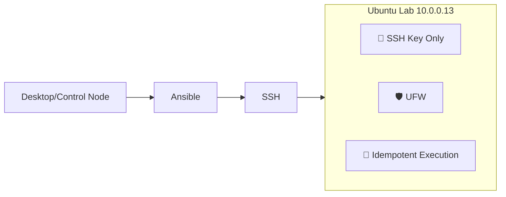

 
# 🖥️ DevOps Lab - Ubuntu Server Automation

## 🎯 Objetivo

Laboratório pessoal para validação de práticas de Infraestrutura como Código (IaC), hardening de servidores e provisionamento de serviços com Ansible, Docker e stacks de observabilidade.

## 🛠️ Stack & Ferramentas

- `Ubuntu Server 26.04`
- `Ansible` (Idempotency, SSH Key Management, UFW, SSH Hardening)
- `Git` + `GitHub` (Versionamento de Infra)

> *(Em breve: Docker, GitHub Actions, Prometheus/Grafana)*

## 📐 Arquitetura & Fluxo

## ⚙️ Pré-requisitos
- Python 3.x
- Ansible Core >= 2.15
- Chave SSH configurada e com acesso ao target node (`ssh-copy-id`)

## 🚀 Como Executar

1. *Dry-run (Apenas simula as mudanças):*
```bash
ansible-playbook -i ansible/inventory/hosts ansible/playbooks/hardening.yml --diff --check
```
2. *Aplicação real:*
```bash
ansible-playbook -i ansible/inventory/hosts ansible/playbooks/hardening.yml --diff
```
> 💡 Use --check para dry-run. Sem --check aplica as mudanças.

## 📌 Lições Aprendidas

- Idempotência não é opcional em produção; é requisito de segurança.
- Hardening básico (SSH + Firewall) reduz superfície de ataque em >90% em ambientes expostos.
- Estrutura modular prepara o terreno para provisionar Docker, CI/CD e monitoring sem refatorar.

## 📈 Próximos Passos

- Provisionar Docker Engine via Ansible
- Deploy de stack de monitoramento (Prometheus + Node Exporter + Grafana)
- Pipeline GitHub Actions para validação de playbooks (ansible-lint + syntax-check)