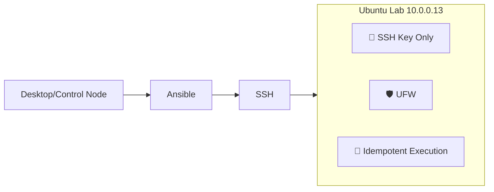

# 🖥️ DevOps Lab - Ubuntu Server Automation

[](https://www.ansible.com/)
[](https://ubuntu.com/)
[](https://www.docker.com/)

## 📋 Visão Geral

Este repositório contém Infrastructure as Code (IaC) para provisionamento e gerenciamento de um ambiente de laboratório doméstico usando Ansible. O objetivo é demonstrar as melhores práticas de DevOps por meio da implementação prática de gerenciamento automatizado de infraestrutura.

## 🎯 Objetivo

- **Provisionamento Automatizado**: Configuração zero-touch do servidor bare metal até o estado pronto para produção 
- **Reforço de Segurança**: autenticação apenas por chave SSH, configuração de firewall, princípio do menor privilégio 
- **Idempotência**: Todos os playbooks podem ser executados várias vezes sem efeitos colaterais (alterado=0 no estado estável) 
- **Auto-Cura**: Detecção de desvio de configuração e correção automática 
- **Recuperação em Desastres**: Reconstrução completa do ambiente em menos de 10 minutos

## 📐 Arquitetura & Fluxo

### 🛠️ Stack & Ferramentas

- `Ubuntu Server 26.04`
- `Ansible` (Idempotency, SSH Key Management, UFW, SSH Hardening)
- `Git` + `GitHub` (Versionamento de Infra)
- `Docker` + `Portainer`

> *(Em breve: GitHub Actions, Prometheus/Grafana)*

### 📂 Estrutura do Repositório

```
.
├── ansible
│   ├── inventory
│   │   ├── group_vars
│   │   │   └── lab_servers
│   │   │       └── main.yml
│   │   └── hosts
│   └── playbooks
│       ├── docker-setup.yml 
│       └── hardening.yml
└── README.md
```


### Fluxo


## 🚀 Como Executar

### ⚙️ Pré-requisitos
- Python 3.x
- Ansible Core >= 2.15
- Chave SSH configurada e com acesso ao target node (`ssh-copy-id`)


### Execução

```bash
# 1. Clone repository
git clone https://github.com/GamaGustavo/devops-lab.git
cd devops-lab

# 2. Configure o inventory
vim ansible/inventory/hosts

# 3. Rode o playbook hardening 
ansible-playbook -i ansible/inventory/hosts ansible/playbooks/hardening.yml

# 4. Rode o playbook docker-setup 
ansible-playbook -i ansible/inventory/hosts ansible/playbooks/docker-setup.yml
```
### Acesso ao Portainer

Após a implantação, acesse a interface web do Portainer:
```
http://<ip da naquina>:9443
```

## 📌 Lições Aprendidas

- Idempotência não é opcional em produção; é requisito de segurança.
- Hardening básico (SSH + Firewall) reduz superfície de ataque em >90% em ambientes expostos.
- Estrutura modular prepara o terreno para provisionar Docker, CI/CD e monitoring sem refatorar.
- implantação no Docker Engine, orquestração Compose, gerenciamento visual 

## 📈 Próximos Passos

- Deploy de stack de monitoramento (Prometheus + Node Exporter + Grafana)
- Pipeline GitHub Actions para validação de playbooks (ansible-lint + syntax-check)